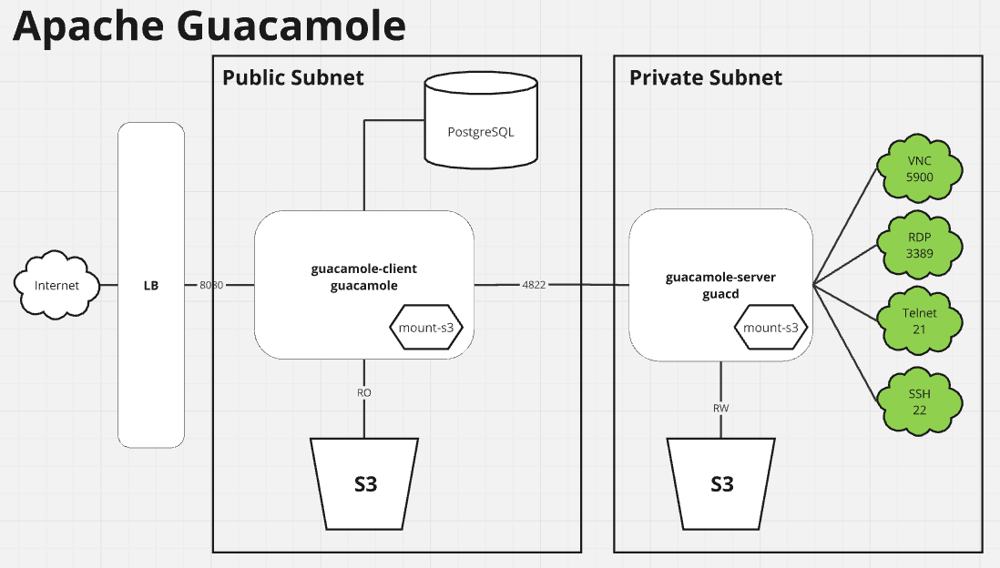

# guacamole-compose-s3
Apache Guacamole S3 docker-compose  

# The problem
- How to have the (guacd) running in the private subnet and have the recordings saved and stored in a safe place outside the EC2 instance or ECS service ? 
- How to watch the in-browser session recordings if the servers (guacd) is running in another EC2 instance without public access ?  

# The solution
AWS has the [mountpoint-s3](https://github.com/awslabs/mountpoint-s3) app that provides a fuse interface for a s3 bucket. 
The containers [guacamole-client-s3](https://github.com/gknepper/guacamole-client-s3) and [guacamole-server-s3](https://github.com/gknepper/guacamole-server-s3/) are built on top of the latest versions of guacamole and guacd and include them in the a docker container with a mountpoint at /record so both containers can have access to the same content. Therefore the in-browser session recordings appears visible for the sessions. 
One possible implementation is to have to have the [guacamole-client-s3](https://github.com/gknepper/guacamole-client-s3) deployed in a public subnet with access to the port 4822 of the [guacamole-server-s3](https://github.com/gknepper/guacamole-server-s3/) running in the private subnet, having them access to the instances in the private subnet.  

# Docker HUB 
Builds created for *linux/amd64* and *linux/arm64* available at
- [https://hub.docker.com/r/gabrielkm/guacamole-server-s3](https://hub.docker.com/r/gabrielkm/guacamole-server-s3)
- [https://hub.docker.com/r/gabrielkm/guacamole-client-s3](https://hub.docker.com/r/gabrielkm/guacamole-client-s3)